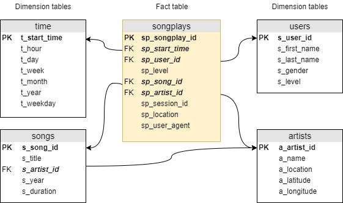

# Data Lake in AWS

> **Stephanie Anderton**
> DEND Project #4
> September 8, 2019

## Sparkify Songplay Data Lake

A music streaming startup, Sparkify, wants to move their data warehouse to a data lake. Their data resides in S3, in a directory of JSON logs on user activity in the Sparkify music streaming app, as well as a directory with JSON metadata on the songs in their app.

This ETL pipeline will extract their data from S3, process it using Spark, and load the data back into S3 as a set of dimensional tables for their analytics team to continue finding insights in what songs their users are listening to.

## Datasets

The two datasets reside in S3:

- Song data: `s3://udacity-dend/song_data`
- Log data: `s3://udacity-dend/log_data`

### Song Dataset

The song dataset consists of files in JSON format, each containing metadata about a single song and the artist of that song. The files are partitioned in subdirectories, organized by the first three letters after `TR` of each song's track ID. For example, these are the file paths for two files in this dataset.

```
song_data/A/B/C/TRABCAJ12903CDFCC2.json
song_data/A/B/A/TRABAVQ12903CBF7E0.json
```

Here is an example of what a single song file, TRABCAJ12903CDFCC2.json, looks like in JSON format.

```json
{"num_songs": 1, "artist_id": "ARULZCI1241B9C8611", "artist_latitude": null, "artist_longitude": null, "artist_location": "", "artist_name": "Luna Orbit Project", "song_id": "SOSWKAV12AB018FC91", "title": "Midnight Star", "duration": 335.51628, "year": 0}
```

### Log Dataset

The log dataset consists of files in JSON format, each containing metadata about event activity in the music streaming app. These files are partitioned in subdirectories, organized by year and month. For example, these are two files in this dataset.

```
log_data/2018/11/2018-11-12-events.json
log_data/2018/11/2018-11-13-events.json
```

Here is an example of what the first line of data (a single event record in JSON format) looks like in the file labelled 2018-11-23-events.json.

```json
{"artist":"Great Lake Swimmers","auth":"Logged In","firstName":"Kevin","gender":"M","itemInSession":0,"lastName":"Arellano","length":215.11791,"level":"free","location":"Harrisburg-Carlisle, PA","method":"PUT","page":"NextSong","registration":1540006905796.0,"sessionId":815,"song":"Your Rocky Spine","status":200,"ts":1542931645796,"userAgent":"\"Mozilla\/5.0 (Macintosh; Intel Mac OS X 10_9_4) AppleWebKit\/537.36 (KHTML, like Gecko) Chrome\/36.0.1985.125 Safari\/537.36\"","userId":"66"}
...
```

**Note**: Only log records with `page` feature as “NextSong” are associated with song plays and loaded to the final database.

## DB Schema

The **sparkify** data model is essentially a star schema (or a minimal snowflake schema because of the relationship between songs and artists), and is implemented in a Postgres database on Redshift. It contains one fact table of songplays and four dimension tables for users, songs, artists, and time.





This schema is not fully normalized, as the `level` feature is replicated in the songplays fact table as well as the users dimension table. It’s structure will allow queries to be optimized for song play analysis, with simpler joins and aggregations. All essential data for songplays and user level is contained in the songplays fact table.

## ETL Pipeline

The ETL pipeline extracts data from directories in S3, processes the data using Spark, and then writes it back in five new tables on S3.

| File   | Purpose                                                      |
| ------ | ------------------------------------------------------------ |
| etl.py | Reads and processes files from the song_data and log_data directories on S3, and loads them into a new **sparkify** data lake on S3. |
| dl.cfg | Contains AWS credentials.                                    |

\* *Additional code, not part of the project requirements.*

## Steps to Run the ETL

In a terminal, run the following command to process the song and log datasets and load the data into the **sparkify** data lake:

1. **python etl.py**

The following is an example of the commands and output generated when running the scripts.

```bash
steph@STEPH-LAPTOP MINGW64 ~/Udacity/DEND/PROJECT_4 (master)
$ python etl.py
Logfile:  ./logs/etl-20190901.log
Extract source data...
Transform data...
Load into final tables...
Check table counts...
(base)
steph@STEPH-LAPTOP MINGW64 ~/Udacity/DEND/PROJECT_4 (master)
$
```

## Sample Queries

Here are some sample queries that can be run to test out the final dimensional tables:

- Return the top 10 most frequently played songs, based on the song ID.
- Return the top 10 users based on the total number of songs they have listened to in the app.
- Get the user ID for the user who has listened to the most number of songs in the app.
- Return the top 5 sessions with the most number of songs, for the top user (found by the previous query) with ID = 49, the user who has listened to the most number of songs.

### Top 10 Songs in songplays

Return the top 10 most frequently played songs, based on the song ID.

**Note**: some song titles appear more than once if there are multiple versions associated with variations in the artist ID.

```sql
top_10_songs = ("""
    WITH songplays_ext  AS (
             SELECT *
             FROM   songplays
             JOIN   songs
             ON     sp_song_id   = s_song_id
             JOIN   artists
             ON     sp_artist_id = a_artist_id
    )

    SELECT   s_title    AS "song title",
             a_name     AS "artist name",
             COUNT(*)   AS count
    FROM     songplays_ext
    GROUP BY s_title, a_name
    ORDER BY count DESC, s_title, a_name
    LIMIT    10;
""")
```

Output:  10 rows

|                                           song title |                    artist name | count |
| ---------------------------------------------------: | -----------------------------: | ----: |
|                                       You're The One |                  Dwight Yoakam |    37 |
| Catch You Baby (Steve Pitron & Max Sanna Radio Edit) |                  Lonnie Gordon |     9 |
|                                  I CAN'T GET STARTED |                     Ron Carter |     9 |
|    Nothin' On You [feat. Bruno Mars] (Album Version) |                          B.o.B |     8 |
|                             Hey Daddy (Daddy's Home) |                          Usher |     6 |
|                             Hey Daddy (Daddy's Home) | Usher featuring Jermaine Dupri |     6 |
|                                         Make Her Say |                       Kid Cudi |     5 |
|                                         Make Her Say | Kid Cudi / Kanye West / Common |     5 |
|                                         Up Up & Away |                       Kid Cudi |     5 |
|                                         Up Up & Away | Kid Cudi / Kanye West / Common |     5 |

The output shows how there is a real need to clean the data; there are many songs that have duplicates with variations on the artist name.

### Top 10 Users in songplays

Return the top 10 users based on the total number of songs they have listened to in the app.

```sql
top_10_users = ("""
    WITH songplays_ext AS (
             SELECT sp_songplay_id, u_first_name, u_last_name, u_user_id
             FROM   songplays
             JOIN   users
             ON     sp_user_id  = u_user_id  AND
                    sp_level    = u_level
        )

    SELECT   DISTINCT( u_first_name || ' ' || u_last_name ) AS "user name",
             u_user_id              						AS "user ID",
             COUNT(*)				 						AS "song count"
    FROM     songplays_ext
    GROUP BY "user ID", "user name"
	ORDER BY "song count" DESC, "user name"
    LIMIT    10;
""")
```

Output:  10 rows

|          user name | user id | song count |
| -----------------: | ------: | ---------: |
|       Chloe Cuevas |      49 |         42 |
|       Kate Harrell |      97 |         32 |
|       Tegan Levine |      80 |         31 |
|       Aleena Kirby |      44 |         21 |
|        Jacob Klein |      73 |         18 |
| Mohammad Rodriguez |      88 |         17 |
|          Lily Koch |      15 |         15 |
|   Jacqueline Lynch |      29 |         13 |
|      Layla Griffin |      24 |         13 |
|      Matthew Jones |      36 |         13 |

Chloe has listened to a total of 42 songs, and Kate a total of 32.

###  ID for user with most songs

Get the user ID for the user who has listened to the most number of songs in the app.

```sql
top_user_id = ("""
    WITH songplays_ext AS (
            SELECT   sp_session_id, u_user_id
            FROM     songplays
            JOIN     users
            ON       sp_user_id = u_user_id  AND
                     sp_level   = u_level
        ),
        session_counts AS (
            SELECT   u_user_id,
                     COUNT( sp_session_id ) AS count
            FROM     songplays_ext
            GROUP BY u_user_id
        ),
        max_session  AS (
            SELECT   MAX(count) AS max_count
            FROM     session_counts
        )

    SELECT  u_user_id AS "top user id"
    FROM    session_counts
    WHERE   count = ( 
            SELECT   max_count
            FROM     max_session
    );
""")
```

Output:  1 rows

| top user id |
| ----------: |
|          49 |

### Top 5 sessions with most songs for Top User (ID = 49)

Return the top 5 sessions with the most number of songs, for the top user with ID = 49, the user who has listened to the most number of songs.

```sql
top_5_sessions_top_user_49 = ("""
    WITH songplays_user AS (
            SELECT  *
            FROM    songplays
            WHERE   sp_user_id  = 49
        ),
        user_sessions AS (
            SELECT  u_first_name, u_last_name, 
                    sp_session_id, sp_start_time, s_title
            FROM    songplays_user
            JOIN    users
            ON      sp_user_id  = u_user_id  AND
                    sp_level    = u_level
            JOIN    songs
            ON      sp_song_id  = s_song_id
        )

    SELECT   (u_first_name || ' ' || u_last_name) AS "user name",
             sp_session_id      				  AS "session ID",
             (DATE_PART('year', 
                         sp_start_time) || '-' || DATE_PART('month', 
                         sp_start_time) || '-' || DATE_PART('day', 
                         sp_start_time))		  AS date,
             COUNT(s_title)     				  AS "song count"
    FROM     user_sessions
    GROUP BY sp_session_id, date, "user name"
    ORDER BY "song count" DESC, date
    LIMIT    5;
""")

```

Output:  5 rows

|    user name | session id |       date | song count |
| -----------: | ---------: | ---------: | ---------: |
| Chloe Cuevas |       1041 | 2018-11-29 |         11 |
| Chloe Cuevas |       1079 | 2018-11-30 |          5 |
| Chloe Cuevas |        816 | 2018-11-21 |          3 |
| Chloe Cuevas |        576 | 2018-11-14 |          2 |
| Chloe Cuevas |        758 | 2018-11-20 |          2 |

In her longest session, on November 29 in 2018, Chloe listened to 11 songs.